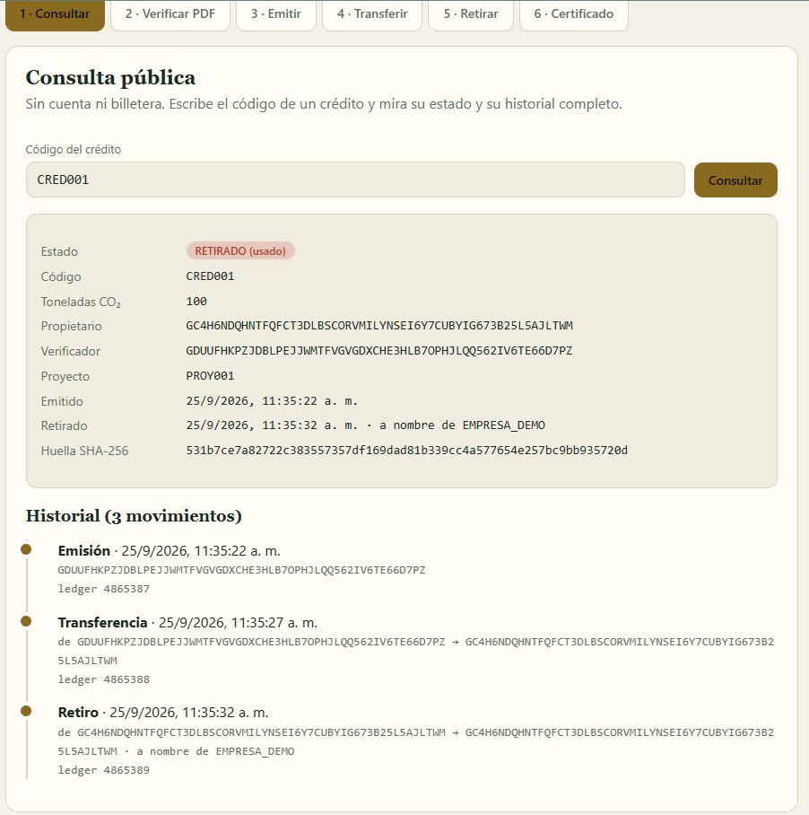

# Entregable 3 — Functional Proof · GreenLedger

**Proyecto:** GreenLedger (CIT Has It All S.A.S., Medellín)
**Red:** Stellar testnet · **Contrato vigente:** [`CANJ564L…P2A5O2`](https://stellar.expert/explorer/testnet/contract/CANJ564LVB4WBAYJWXRQKHJII456RW6XBWWM2FQCSSC6HLG27JP2A5O2)
**Front en vivo:** https://greenledger-app-emprendamosahora2030-5355s-projects.vercel.app

## 1. Front construido

El front es una página web única, sin servidor propio, que vive en `frontend/index.html`. Habla directamente con el contrato Soroban de GreenLedger a través del nodo RPC público de testnet (`soroban-testnet.stellar.org`) y firma las operaciones de escritura con la billetera Freighter. Esta decisión de diseño tiene una razón concreta: el producto promete que cualquiera puede verificar un crédito de carbono sin depender de nosotros, y un front que consulta la cadena directamente no puede mostrar nada que la cadena no diga.

La interfaz recorre el flujo principal del MVP definido en el Product Blueprint, que va desde la emisión de un crédito hasta su retiro definitivo y la entrega de un certificado verificable. Se organiza en seis pantallas, accesibles desde una barra de pestañas numeradas, y en un encabezado fijo con tres indicadores: toneladas emitidas, toneladas retiradas y un enlace al contrato en Stellar Expert. Los dos primeros números se leen del contrato en cada carga de la página (`total_emitido` y `total_retirado`).

**Pantalla 1 · Consultar (pública).** El usuario escribe el código de un crédito y obtiene su ficha: estado (EMITIDO o RETIRADO), toneladas de CO₂, propietario actual, verificador que lo emitió, proyecto de origen, fechas, beneficiario del retiro y huella SHA-256 del certificado. Debajo aparece el historial completo como una línea de tiempo con cada emisión, transferencia y retiro, con su fecha y su número de ledger. No requiere cuenta ni billetera. Esta pantalla responde a la necesidad del comprador corporativo y del auditor del Blueprint: confirmar en segundos que un crédito es real, único y no fue usado.

**Pantalla 2 · Verificar PDF.** El usuario elige el código de un crédito y adjunta el archivo del certificado. El navegador calcula la huella SHA-256 del archivo localmente, sin enviarlo a ningún servidor, y la compara con la registrada en la cadena mediante `verificar_certificado`. El resultado es un mensaje claro: auténtico o no coincide. Si alguien altera una sola letra del documento, la huella cambia y la verificación falla.

**Pantalla 3 · Emitir.** Formulario para verificadores autorizados: código del crédito, toneladas, dirección del propietario, código del proyecto y certificado técnico. De nuevo, el archivo no se sube; solo se registra su huella. La operación se firma con Freighter y el contrato rechaza a cualquier cuenta que no esté en la lista de verificadores.

**Pantalla 4 · Transferir.** El propietario actual indica el crédito y la nueva dirección. El contrato exige la firma del propietario, impide transferir a la misma dirección e impide mover un crédito ya retirado.

**Pantalla 5 · Retirar.** El propietario retira el crédito a nombre de una empresa o código de beneficiario. Antes de enviar se pide una confirmación explícita, porque el retiro es definitivo e irreversible. Es la pieza que impide el doble conteo: un crédito retirado no admite ninguna operación posterior.

**Pantalla 6 · Certificado.** Para un crédito retirado, genera un certificado de compensación con las toneladas, el beneficiario, la fecha, el código del crédito, la huella del certificado técnico y el contrato, listo para imprimir o guardar como PDF desde el navegador. El comprador puede adjuntarlo a su reporte de sostenibilidad, y quien lo reciba puede validarlo en la pantalla 1.

**Mensajes de error comprensibles.** Los errores del contrato se traducen a frases en español (por ejemplo, el código `#5` se muestra como “Ese crédito ya fue retirado; no admite más operaciones”). Esto responde a la historia de QA del Blueprint.

**Aspectos técnicos.** Es HTML, CSS y JavaScript sin paso de compilación. Usa `@stellar/stellar-sdk` 13.1.0 y `@stellar/freighter-api` 3.0.0 desde CDN. La configuración (ID del contrato, URL del RPC y passphrase) está en tres constantes al inicio del script. Respeta el modo claro y oscuro del sistema, reduce las animaciones si el usuario lo prefiere y funciona en pantallas de celular.

**Captura real.** Consulta del crédito `CRED001` en testnet: estado retirado, 100 t, propietario, verificador, huella y los tres movimientos del historial (emisión en el ledger 4865387, transferencia en el 4865388 y retiro en el 4865389).

**Cómo verlo funcionando:** abrir el enlace de Vercel indicado arriba, o ejecutarlo localmente con las instrucciones del README. Para probar con datos reales del contrato vigente, consultar `CRED001` (retirado) o `LOTE001` a `LOTE003` (emitidos).

## 2. Decisión técnica

**Opción elegida: A — contrato propio.**

GreenLedger ya tiene un contrato Soroban propio, desplegado y probado en testnet. Esta semana la decisión queda registrada y justificada.

**Qué hace el contrato y por qué hace falta uno propio.** El valor central del producto es una regla de negocio muy específica: cada tonelada certificada es un activo único con un ciclo de vida cerrado (emitido, transferido cero o más veces, retirado una sola vez) y nadie puede emitirlo dos veces, venderlo dos veces ni usarlo después de retirado. Además, solo verificadores autorizados pueden emitir, y cada crédito guarda la huella SHA-256 de su certificado técnico y un historial de propiedad de solo escritura. Estas reglas se ejecutan en la cadena, no en un servidor nuestro, y eso es lo que permite que un auditor externo las verifique sin confiar en nosotros.

**Qué se descartó.** Se descartó la opción B, usar una plataforma existente del ecosistema (como una herramienta de escrow o de emisión de tokens genéricos). Esas herramientas resuelven pagos o tokens fungibles, pero no modelan activos únicos con retiro irreversible, lista de verificadores acreditados, huella de certificado ni historial paginado por crédito. Adaptarlas habría significado perder justo las garantías que diferencian al producto, o construir encima una capa de reglas que terminaría siendo, de hecho, un contrato propio.

**Apoyo en el uso de Stellar del Blueprint.** El Blueprint define Soroban para la lógica, el ledger para el registro permanente, el RPC para la conexión de la aplicación y Stellar Expert como verificador público independiente. La decisión es coherente con esa arquitectura: el front no tiene backend, lee y escribe sobre el contrato propio y cualquiera puede contrastar lo que ve con el explorador.

**Estado del contrato.** 34 pruebas automatizadas superadas. Gobernanza del administrador: cambio de administrador en dos pasos (propuesta y aceptación) y administración con multifirma 2-de-3 verificada en testnet (contrato `CCJWT5XBUIU6IPOCC6GDQC5LLC5XRGGB7NUC2AOCVZWZE3HGB5FKPX3T`, documentado en el README). La multifirma de testnet usa llaves de prueba; para mainnet se definirán tres firmantes reales e independientes.

## 3. Participación del equipo

GreenLedger es un proyecto individual dentro del curso.

| Integrante | Usuario de GitHub | Aporte en este entregable |
|---|---|---|
| José Luis Olaya | [`emprendamosahora2030-sudo`](https://github.com/emprendamosahora2030-sudo) | Diseño y construcción del front (`frontend/`), decisión técnica, gobernanza del contrato (administrador en dos pasos y multifirma 2-de-3 con sus pruebas y despliegue en testnet), documentación y README. |

## 4. Bloqueos y siguiente paso

**Pendiente:**
- Las pantallas de lectura (consulta, verificación de PDF y certificado) se probaron con datos reales de testnet. Las operaciones de escritura (emitir, transferir, retirar) requieren Freighter y una cuenta de verificador, y falta probarlas de punta a punta con la billetera real.
- Faltan definir tres firmantes reales e independientes para la multifirma de mainnet.
- Migrar el SDK del contrato de la versión 22 a la 28 en una rama aparte.
- Auditoría externa antes de cualquier despliegue en mainnet.

**Siguiente paso hacia el MVP:** desplegar el front en Vercel, correr el flujo completo con Freighter (emitir, transferir, retirar y verificar un PDF) y registrar los hashes de las transacciones; después, preparar el contrato limpio con administración multifirma para mainnet.
